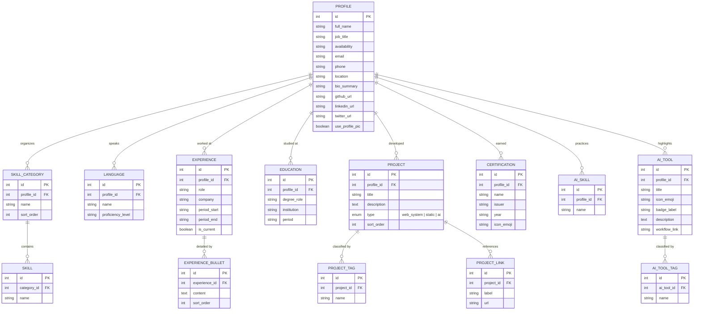

# Portfolio Backend ERD

This document outlines the Entity Relationship Diagram (ERD) for a modernized backend implementation of this portfolio.



## MySQL Schema

You can use the following SQL script to initialize your database. This script includes all the tables and initial data based on your current portfolio.

```sql
-- Portfolio MySQL Schema and Initial Data
CREATE DATABASE IF NOT EXISTS portfolio_db;
USE portfolio_db;

-- [Tables: profiles, skill_categories, skills, experience, education, projects, languages, certifications, ai_skills, ai_tools]
-- See portfolio_schema.sql for the full script with INSERT statements.
```

> [!TIP]
> I have also created a standalone file [portfolio_schema.sql](file:///c:/Users/merin/.gemini/antigravity/scratch/Portfolio/portfolio_schema.sql) which contains the complete executable script including all your current data!

